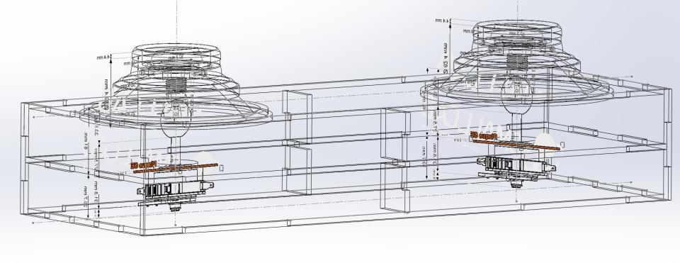

# Groove Coaster Controller
GrooveCoaster Controller replica with dimensions from real cabinet  
Box is 20 x 10 x 56.5 cm

(part linking the ls32 and joy_stick is missing in this picture: you can [look at it here](joy_tube.STL))

# needed
- a teensy 3.2 or 3.1
- a 3D printer
- a laser cutting machine
- 5mm plywood
- 2 x seimitsu LS32-SE joysticks
- 2 x 40mm buttons
- 2 screws for locking the top of the sticks
- 2 x large 6mm washers
- 2 x anti vibration 6mm nuts
- 8 x computer fan screws
- wood glue

# things to 3d print
- 2 x joy_stick.stl
- 2 x joy_base.stl
- 2 x joy_tube.stl

# things to laser cut
- 2 x box_side.dxf
- 2 x box_insert.dxf (goes on box_middle, helps for rigidity)
- 1 x box_front.dxf
- 1 x box_front.dxf (with a cut for your usb panel mount adapter)
- 1 x box_top.dxf
- 1 x box_middle.dxf
- 1 x box_bottom.dxf

# assembly
### warning: look at the picture ! be careful on which way goes up during the box assembly ! box_middle should be closer to top, not to bottom
- assemble the printed joy_tube on the ls32 sticks using the washer and the nut
- screw the ls32s to the box_middle (joysticks under the board) using the fan screws
- glue the joy_bases to the box_top (wood glue should do it)
- assemble the sides, front and top panel using the glue
- assemble the 40mm buttons on the joy_sticks, and solder the wires to them
- assemble the joy_sticks on the joy_tube
- solder wires to the ls32s 
- solder everything to the teensy
- assemble bottom panel and then rear panel when you confirmed everything works

# soldering
- Solder a GND wire to all leds and buttons
- Solder pins A5, A6, A7, A8 and 3, 4, 5, 6 to left and right joysticks
- Solder pins A4 and 7 to left and right buttons
- Solder pins A3 and 8 to left and right leds
